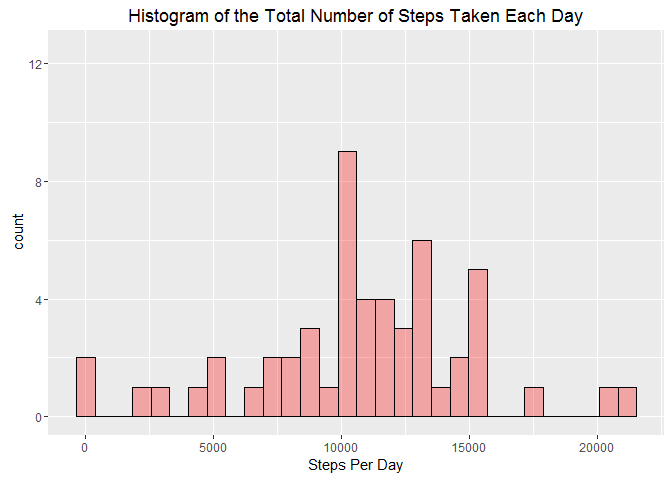

# Reproducible Research: Peer Assessment 1


## Loading and preprocessing the data


```r
dfSteps = read.csv("activity.csv")
```
## What is mean total number of steps taken per day?


```r
library(dplyr)
library(ggplot2)

stepsPerDay = dfSteps %>% tbl_dt() %>% 
              group_by(date) %>% 
              summarize("Total" = sum(steps))

graph = ggplot(data = stepsPerDay, aes(Total))
graph = graph + geom_histogram(col = "black", fill = "red", alpha = 0.3, na.rm = TRUE)
graph = graph + ylim(c(0, 12.5))
graph = graph + labs(x = "Steps Per Day")
graph = graph + labs(title = "Histogram of the Total Number of Steps Taken Each Day")
graph
```

<!-- -->

```r
mnSteps = mean(stepsPerDay$Total, na.rm = TRUE)

medSteps = median(stepsPerDay$Total, na.rm = TRUE)
```
The mean of the number of steps taken per day is **10,766.19**.

The median of the number of steps taken per day is **10,765**.


## What is the average daily activity pattern?


```r
stepsAverage = dfSteps %>% tbl_dt() %>% 
               group_by(interval) %>% 
               summarize("Average" = mean(steps, na.rm = TRUE))

graph = ggplot(data = stepsAverage, aes(x = interval, y = Average))
graph = graph + geom_line()
graph = graph + labs(title = "Average Number of Steps Taken Throughout the Day")
graph
```

<!-- -->

```r
intervalMaxSteps = stepsAverage$interval[which.max(stepsAverage$Average)]
```

The 5-minute interval that, on average, contains the maximum number of steps is **835.**

## Imputing missing values


```r
nMissing = sum(is.na(dfSteps$steps))
```

The total number of missing values in the dataset is **2304**.

In the following R code snippet we create a new dataset that is equal to the original dataset but with the missing data filled using the average number of steps for that specific time interval.


```r
dfStepsFilled = dfSteps

for (i in 1 : nrow(dfStepsFilled)) {
    if (is.na(dfStepsFilled[i, "steps"])) {
        dfStepsFilled[i, "steps"] = 
            filter(stepsAverage, interval == dfStepsFilled[i, "interval"])$Average
        
    }
}
```

In the following chart we superimpose the new histogram calculated using the filled in dataset (grey bars) on top of the original histogram that was plotted above. We can see that the only effect of imputing the missing values was to increase the count for the histogram bar that includes the average number of steps per day (10,766.19). That result was expected given the strategy that was chosen to fill the missing values, in which we substituted the NA's in the dataset with the average number of steps calculated for the specific time interval in which data was missing.


```r
stepsPerDayFilled = dfStepsFilled %>% tbl_dt() %>% 
                    group_by(date) %>% 
                    summarize("Total" = sum(steps))

graph = ggplot(data = stepsPerDay, aes(Total))
graph = graph + geom_histogram(col = "black", fill = "red", alpha = 0.3, na.rm = TRUE)
graph = graph + geom_histogram(data = stepsPerDayFilled, aes(Total), fill = "black", alpha = 0.3)
graph = graph + ylim(c(0, 12.5))
graph = graph + labs(x = "Steps Per Day")
graph = graph + labs(title = "Histogram of the Total Number of Steps Taken Each Day")
graph
```

<!-- -->

```r
mnSteps = mean(stepsPerDayFilled$Total)

medSteps = median(stepsPerDayFilled$Total)
```

The mean of the number of steps taken per day using the filled in dataset is **10,766.19**.

The median of the number of steps taken per day using the filled in dataset is **10,766.19**.

## Are there differences in activity patterns between weekdays and weekends?


```r
# Creation of the new factor variable to indicate whether a given date 
# is a weekday or weekend day.
dfStepsFilled$Type = weekdays(strptime(dfStepsFilled$date, "%Y-%m-%d"))

indWeekend = dfStepsFilled$Type == "Saturday" | dfStepsFilled$Type == "Sunday"
dfStepsFilled[indWeekend, "Type"] = "Weekend"
dfStepsFilled[!indWeekend, "Type"] = "Weekday"

dfStepsFilled$Type = as.factor(dfStepsFilled$Type)

# Calculation of the average number of steps taken on weekdays and weekends
stepsAverage = dfStepsFilled %>% tbl_dt() %>% 
               group_by(Type, interval) %>% 
               summarize("Average" = mean(steps, na.rm = TRUE))


graph = ggplot(data = stepsAverage, aes(interval, Average))
graph = graph + geom_line() + facet_wrap(~Type, nrow = 2)
graph = graph + labs(title = "Average Number of Steps Taken Throughout the Day")
graph = graph + labs(y = "Average Number of Steps", x = "Interval")
graph
```

<!-- -->
